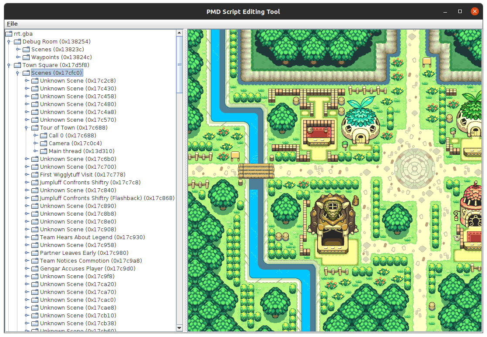

# PMD-Script-Editor

PMD-Script-Editor is a java program for editing Pokemon Myster Dungeon: Red Rescue Team scripts. It was created by MegaMinerd.

## Installation

This program requires Java 11. Download the latest JDK or a JRE that supports java 11.

Use the [ant](https://ant.apache.org/) build system in the main directory to compile.

```bash
ant
```

## Features
Can view world maps, scripts, and script structure.


## Future Features
These are Roughly in order of priority
* Following 0x0C and 0x0D commands to their respective scripts.
* Add more names for script commands
* Add more parameters for commands in decompiled window.


## Contributing
Pull requests are welcome.
